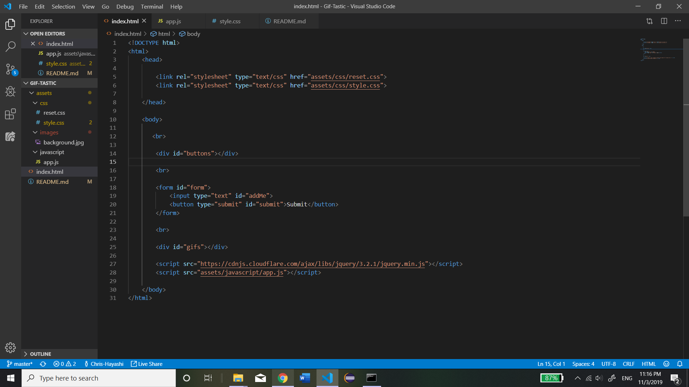
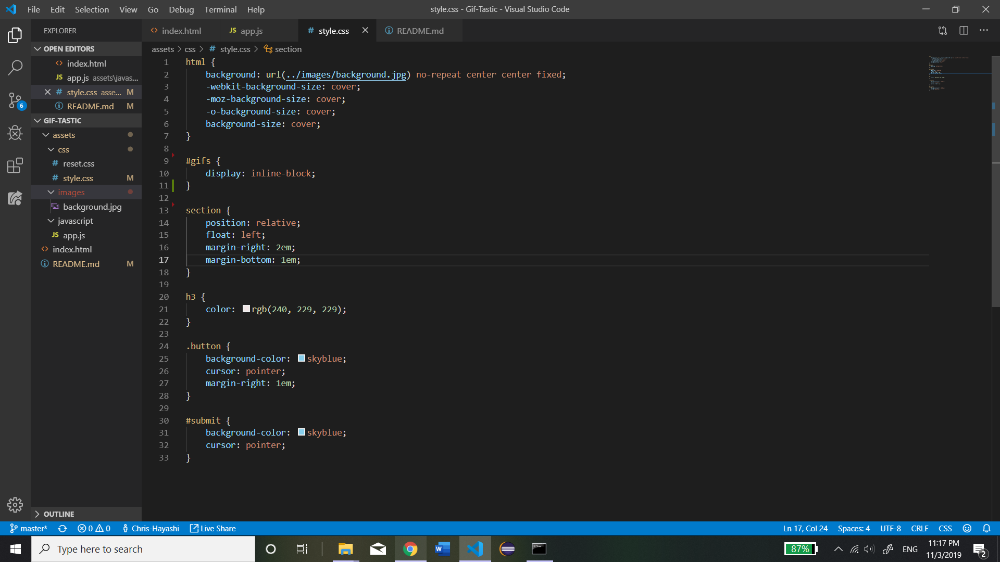
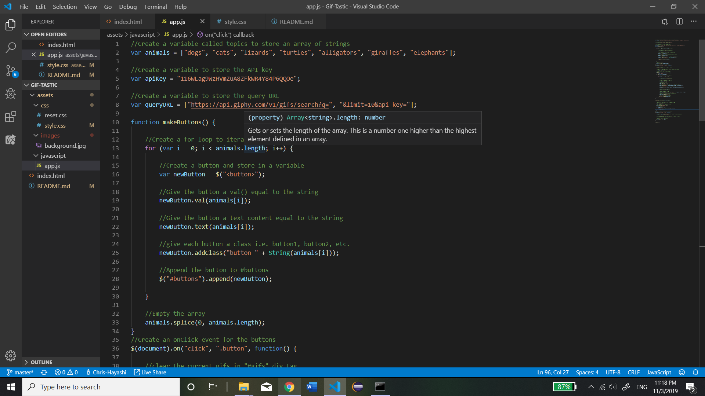
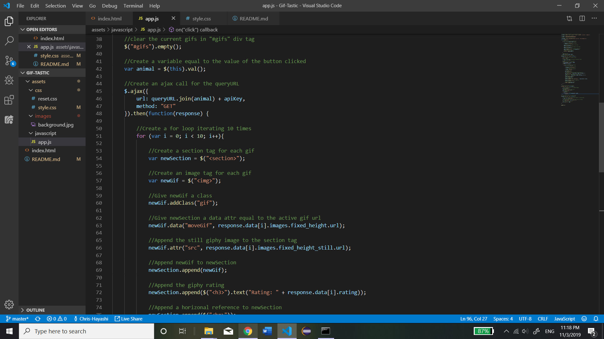
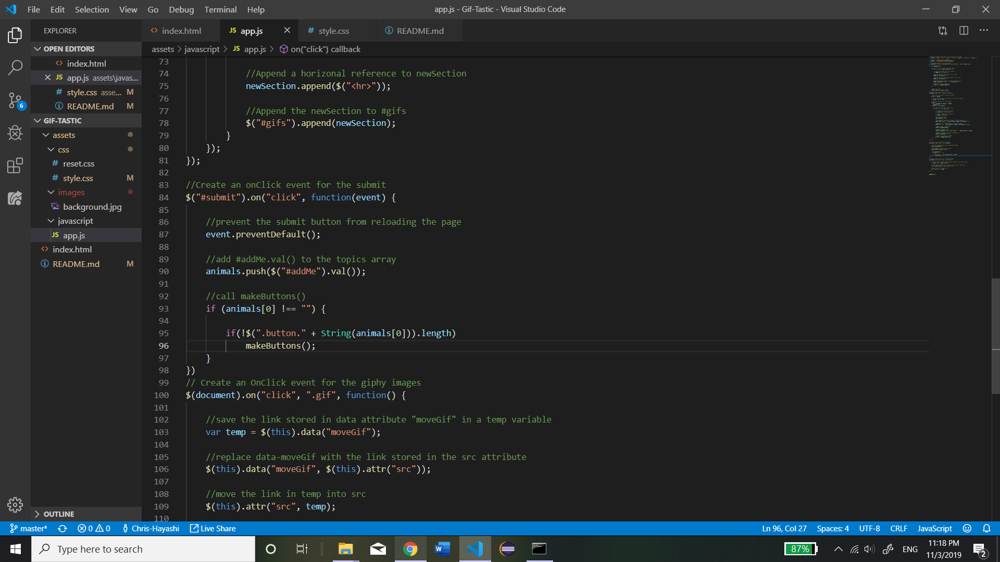
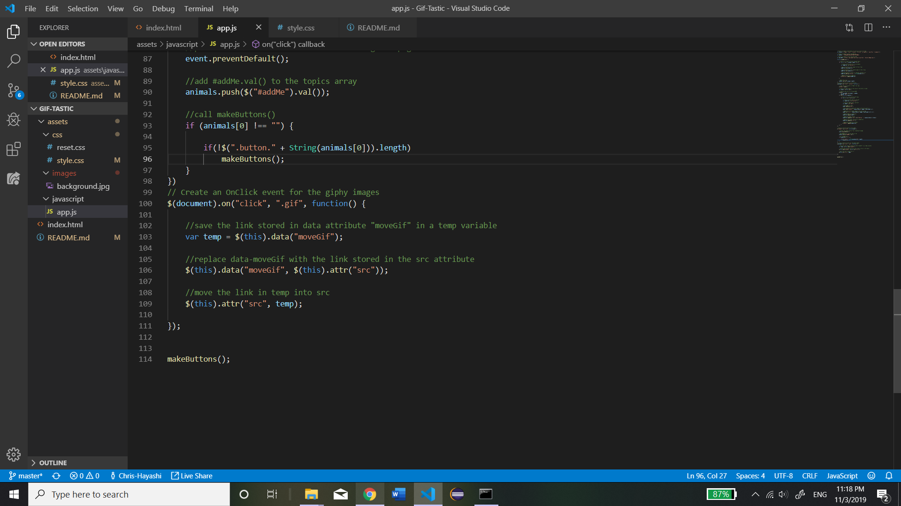

# Gif-Tastic

This website was designed by: Christopher Hayashi

The project: To design a website that allows the user to display gifs onto the page using an api url. This website displays a default list of buttons at the top of the screen and the user has the option to type in text and add a button. When the page is loaded, no gifs are displayed.

How it works: When a button is clicked, an ajax call is made and returns a list of 10 gifs. The gifs are then displayed on the screen as images. If an image is clicked, the src attribute of the image tag is changed to an active gif. The user has the option to play/pause the gif in this manner. When text is entered into the input field and the submit button is clicked, a new button is appended to the DOM containing the entered text. The user has the option to display any gif of his/her choosing in this manner. No button is appended when the input field is empty. Additionally, the same button cannot be appended twice. The api used in this website is "giphy".

Technologies Used: Visual Studio Code, Google Chrome, Git Bash

Screenshots of the code:

    index.html:

    
    style.css:

    app.js:

